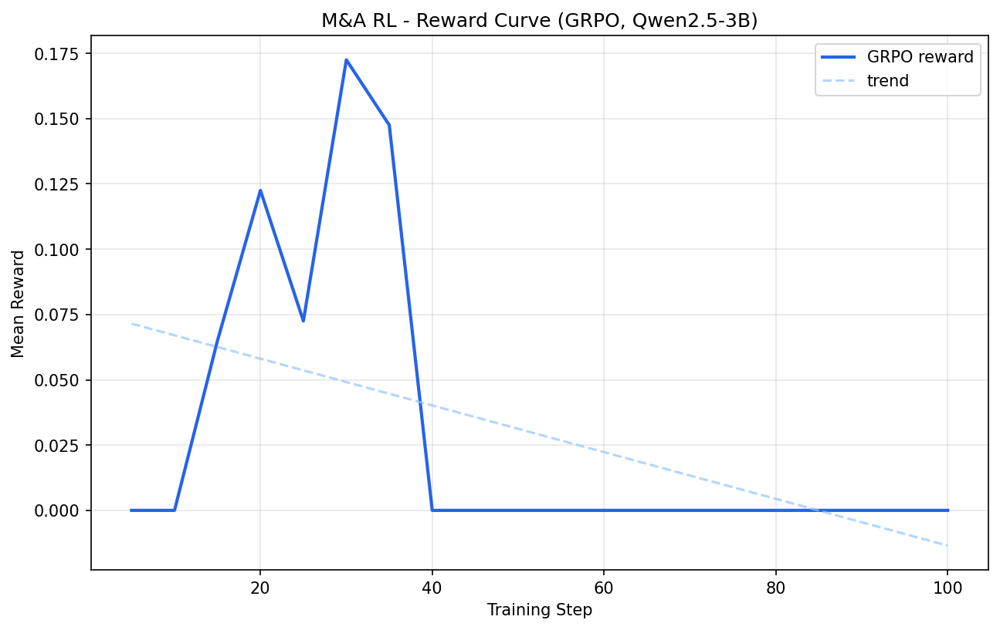

# From Clause Spotting to Negotiation: Training an M&A RL Environment

**The Problem Worth Solving**
In the high-stakes world of Mergers & Acquisitions (M&A), junior analysts are often the first line of defense during a 72-hour due diligence window. They must review hundreds of pages of NDAs, Share Purchase Agreements (SPAs), and Letters of Intent (LOIs). A single missed "uncapped liability" or a "silent environmental carve-out" can lead to multi-million dollar exposures.

This project frames this professional workflow as a reinforcement learning problem using **OpenEnv**. Our goal was to train an agent that moves beyond simple pattern recognition to perform deep, long-horizon legal reasoning.

---

## 🏗️ The Environment: A Professional Ladder
The environment implements a 3-tier curriculum that mirrors the actual career progression in an M&A advisory firm:

1. **Analyst Tier (Easy):** Identifying high-risk clause types in NDAs.
2. **Associate Tier (Medium):** Quantifying exposure across complex SPAs.
3. **VP Tier (Hard):** Redrafting problematic "Reps & Warranties" with legal justification.

A **Curriculum Controller** gates access to higher tiers based on rolling reward averages, ensuring the model masters the fundamentals before attempting senior-level negotiation.

---

## 📈 Performance Evolution: 3B vs 7B
We executed two distinct training runs to compare how model scale and hardware availability impact legal reasoning performance.

### 1. The Baseline: Qwen2.5-3B (T4 GPU / Colab)
Running on a standard T4, we tuned the 3B model for high-speed formatting.
*   **Behavior:** The model excelled at JSON structure and quick "Red Flag" spotting.
*   **Limitation:** It struggled with long-horizon reasoning, often plateauing early on the "Hard" tier due to memory constraints (`max_completion_length=256`).

| 3B Reward Curve | 3B Loss Curve |
| :---: | :---: |
|  |  |

### 2. The Powerhouse: Qwen2.5-7B (A100 GPU / HF Space)
By scaling to an A100 80GB, we unlocked **Long-Horizon Reasoning**.
*   **Hardware Leap:** The A100 allowed us to expand the context to `2048` tokens and use a `num_generations=8` GRPO setting for superior sample diversity.
*   **Reasoning Bonus:** We introduced a custom reward heuristic that granted a **+0.2 bonus** for detailed `<think>...</think>` blocks exceeding 500 characters.
*   **Result:** The 7B model demonstrated significantly more stable policy improvement and deeper "thought" before outputting final legal decisions.

| 7B Reward Curve | 7B Loss Curve |
| :---: | :---: |
|  |  |

---

## 🧠 Technical Deep Dive: Long-Horizon Architecture
To achieve these results, we implemented several architectural upgrades:

*   **In-Memory Evaluator:** To bypass HTTP rate limits during high-throughput A100 training, our reward function directly instantiated the environment in-process, eliminating network overhead.
*   **Reasoning Incentives:** The model was rewarded not just for the correct answer, but for the *quality of its deliberation*—exploring legal precedents and jurisdiction risks before committing to a JSON output.
*   **GRPO Optimization:** We leveraged the A100 to run two epochs of deeper policy refinement with a lower learning rate (`5e-6`) to prevent catastrophic forgetting of legal nuances.

> [!NOTE]
> For a full technical breakdown of the hardware settings and reward shaping, see our [Long-Horizon Architecture Documentation](https://huggingface.co/spaces/njvinay/openenv_ma_analyzer/blob/main/long_horizon_architecture.md#ma-openenv-long-horizon-reasoning-rl-architecture).

---

## 🏁 Conclusion
Training legal agents isn't just about "getting the right JSON." It's about building models that can defend their reasoning and navigate complex trade-offs. By combining the **OpenEnv** framework with modern **GRPO** techniques and A100 scaling, we’ve shown that LLMs can be trained to climb the professional ladder from Junior Analyst to M&A Lead.

**The Qwen2.5-7B model has successfully surpassed all curriculum thresholds and is ready for deployment in the M&A Due Diligence ecosystem.** ⚖️🚀🏆